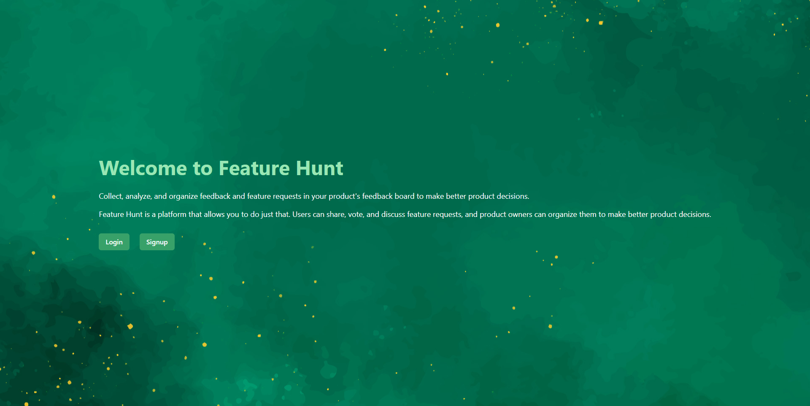
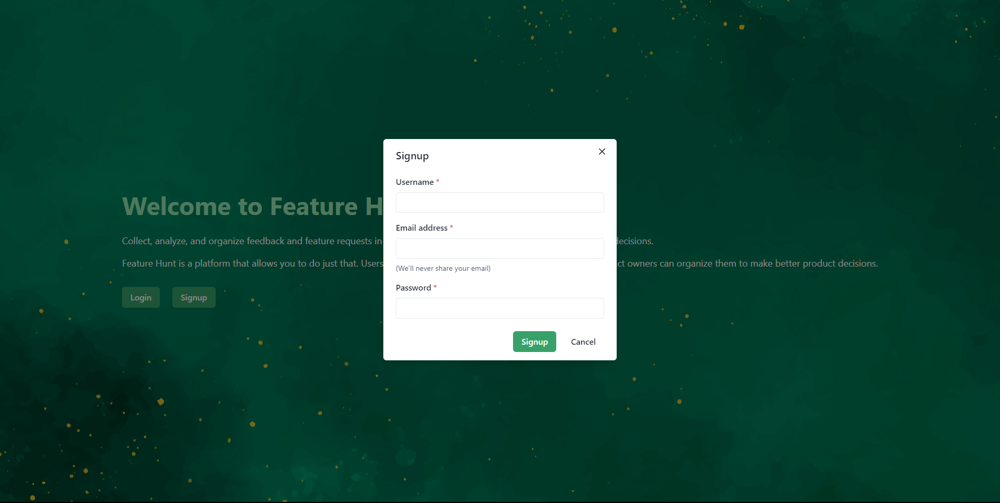
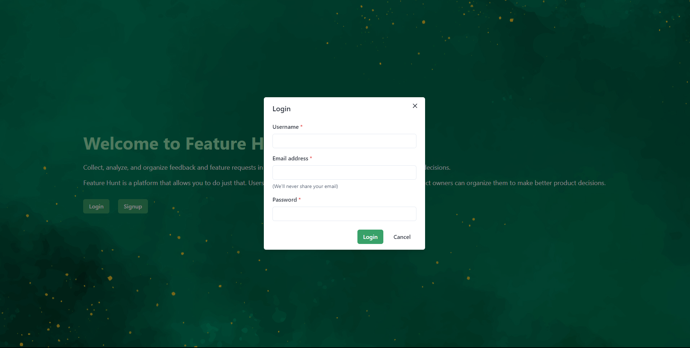
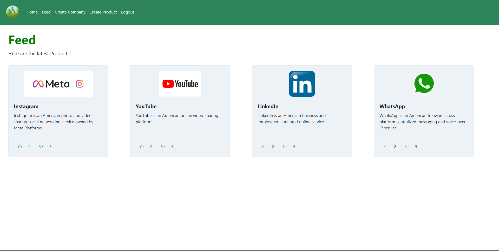
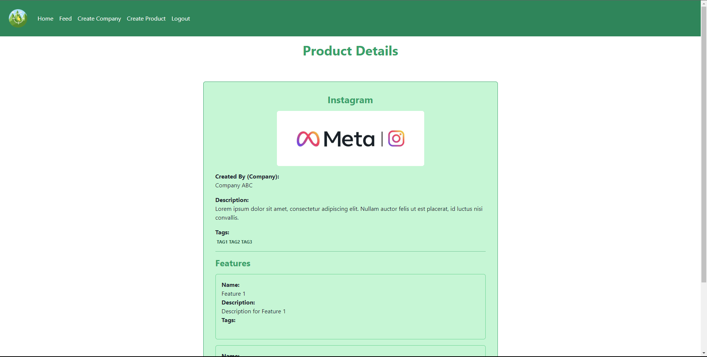
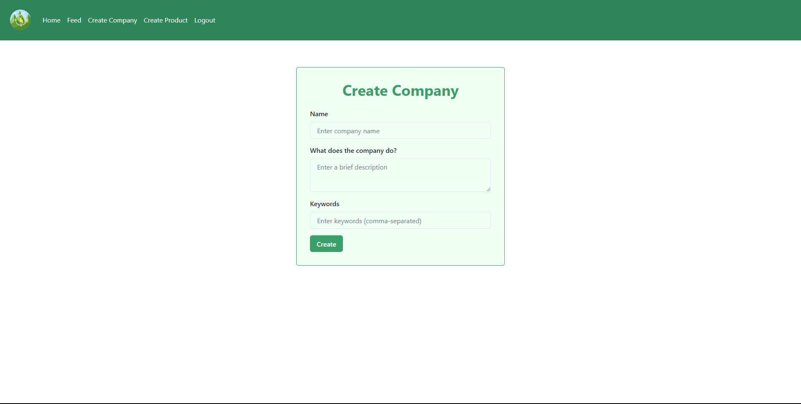
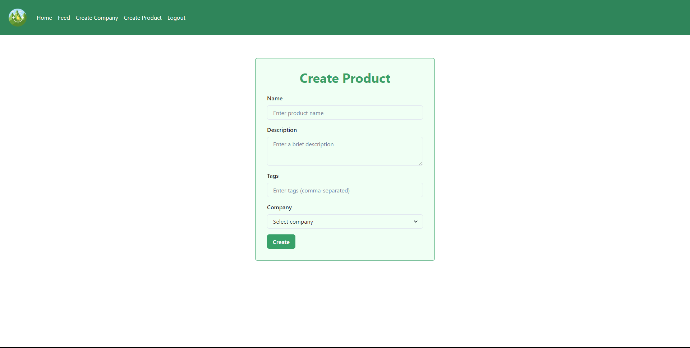
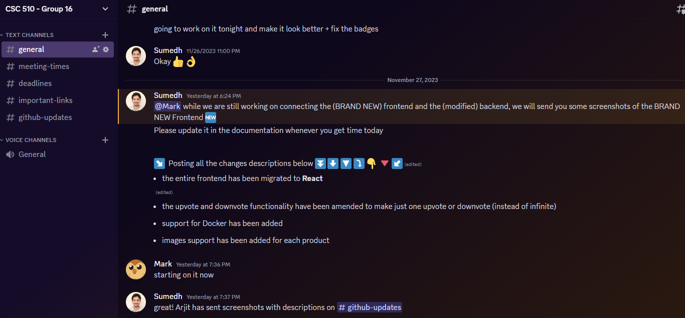

<p align="center">

</p>

[](https://app.codacy.com/gh/Sumedh-Patkar/feature-hunt/dashboard?utm_source=gh&utm_medium=referral&utm_content=&utm_campaign=Badge_grade)
[](https://doi.org/10.5281/zenodo.10211849)
[](https://github.com/Sumedh-Patkar/feature-hunt/issues)
[](https://github.com/Sumedh-Patkar/feature-hunt/issues?q=is%3Aissue+is%3Aclosed)
[](https://github.com/Sumedh-Patkar/feature-hunt/blob/main/LICENSE)
[](https://github.com/prettier/prettier)

[](https://docs.docker.com/compose/)


## 📋 Table of contents

- [🎯 Introduction](https://github.com/Sumedh-Patkar/feature-hunt/tree/main#-introduction)
- [🖥️ Technologies](https://github.com/Sumedh-Patkar/feature-hunt/tree/main#%EF%B8%8F-technologies)
- [📎 Usage Instructions](https://github.com/Sumedh-Patkar/feature-hunt#-usage-instructions)
	- [Landing Page](https://github.com/Sumedh-Patkar/feature-hunt#landing-page)
		- [Signing Up](https://github.com/Sumedh-Patkar/feature-hunt#signing-up)
		- [Logging In](https://github.com/Sumedh-Patkar/feature-hunt#logging-in)
	- [Feed Page](https://github.com/Sumedh-Patkar/feature-hunt#feed-page)
		- [Product Details](https://github.com/Sumedh-Patkar/feature-hunt#product-details)
	- [Company and Product Creation](https://github.com/Sumedh-Patkar/feature-hunt#product-details)
		- [Product Creation](https://github.com/Sumedh-Patkar/feature-hunt#product-creation)
- [🆕 Changelog](https://github.com/Sumedh-Patkar/feature-hunt#-changelog)
- [🔮 Future Scope](https://github.com/Sumedh-Patkar/feature-hunt#-future-scope)
- [👤 Contributors](https://github.com/Sumedh-Patkar/feature-hunt/tree/main#-contributors)


## 🎯 Introduction

Being able to receive and track feedback from customers is a valuable tool when it comes to product development. 

Feature Hunt allows one to effortlessly submit, endorse, and participate in discussions surrounding feature and change requests. The software also allows product administrators to efficiently categorize and prioritize submissions to strengthen their decision making process.

Start leveraging Feature Hunt today to help you make informed decisions for your product.


## 🖥️ Technologies

Feature Hunt is built with:

<p align="left">
<div>
  <a href="https://www.docker.com/" target="_blank"> 
    <a> Docker</a>
  </a>
</div>	
<div>
  <a href="https://react.dev/" target="_blank"> 
    <a> React</a>
  </a>
</div>	
<div>
  <a href="https://www.mongodb.com" target="_blank"> 
    <a> MongoDB</a>
  </a>
</div>
<div>
  <a href="https://www.python.org" target="_blank"> 
    <a> Python</a>
  </a>
</div>
<div>
  <a href="https://www.javascript.com" target="_blank"> 
    <a> JavaScript</a>
  </a>
</div>
<div>
  <a href="https://developer.mozilla.org/en-US/docs/Glossary/HTML" target="_blank"> 
    <a> HTML</a>
  </a>
</div>
<div>
  <a href="https://developer.mozilla.org/en-US/docs/Glossary/CSS" target="_blank"> 
    <a> CSS</a>
  </a>
</div>  
</p>

## 📎 Usage Instructions

### Landing Page

Our intuitive home page is the first thing you'll see. If you're a new user, go ahead and click the login button. Otherwise, the sign up button will allow you create a new account for Feature Hunt.



#### Signing Up



#### Logging In



### Feed Page

Once you're logged in, you'll be greeted by the Feed page. Here, you can view existing products as well as express your feedback by upvoting or downvoting. Clicking on the product also allows you to view more information about it.



#### Product Details



### Company and Product Creation

If you'd like to add your own product and have it available for feedback, you'll first have to create a Company. To do this, click "Create Company" first at the top left. This will bring you to the company creation page where you can enter details such as a brief description or keywords.



#### Product Creation

With the creation of your company, you can click the "Create Product" button at the top left to add your product to Feature Hunt. Make sure to select the right company for your product!




## 🆕 Changelog

### Version 5.2
#### 11/27/2023

- Migrated frontend to React
- Rebuilt the UI from the ground up
- Added support for user uploadable images

### Version 5.1
#### 11/24/2023

- Added support for Docker
- Fixed major critical breaking bugs and issues
- Fixed voting functionality


## 🔮 Future Scope

We fully believe in supporting and updating our products and Feature Hunt is no different. Below are the planned features that we intend to add to Feature Hunt to enhance functionality and usability.

- Dark Mode
- Social Account Authorization
- Product Owner Dashboard
- User Suggestion Statuses
- Private Products / Restricted Access
- Advanced Search Filters


## 👤 Contributors

<table>
	<tr>
		<td> Phase 1</td>
		<td align="center"><a href="https://github.com/shahrk/"><br /><sub><b>Raj Shah</b></sub></a></td>
		<td align="center"><a href="https://github.com/Nirav1929/"><br /><sub><b>Nirav Patel</b></sub></a><br /></td>
		<td align="center"><a href="https://github.com/Parth59/"><br /><sub><b>Parth Kanakiya</b></sub></a><br /></td>
		<td align="center"><a href="https://github.com/mithildave/"><br /><sub><b>Mithil Dave</b></sub></a><br /></td>
		<td align="center"><a href="https://www.github.com/BhargavJethwa"><br /><sub><b>Bhargav Jethwa</b></sub></a><br /></td>   
	</tr>
	<tr>
		<td> Phase 2</td>
		<td align="center"><a href="https://github.com/etracey7/"><br /><sub><b>Emily Tracey</b></sub></a></td>
		<td align="center"><a href="https://github.com/peeyush10234/"><br /><sub><b>Peeyush Taneja</b></sub></a><br /></td>
		<td align="center"><a href="https://github.com/jhnguye4/"><br /><sub><b>Jonathan Nguyen</b></sub></a><br /></td>
		<td align="center"><a href="https://github.com/snapcat/"><br /><sub><b>Leila Moran</b></sub></a><br /></td>
		<td align="center"><a href="https://www.github.com/shraddhamishra7"><br /><sub><b>Shraddha Mishra</b></sub></a><br /></td>
	</tr>
	<tr>
		<td> Phase 3</td>
		<td align="center"><a href="https://github.com/surajdm123/"><br /><sub><b>Suraj Devatha</b></sub></a></td>
		<td align="center"><a href="https://github.com/Sneha-at"><br /><sub><b>Sneha Aradhey</b></sub></a><br /></td>
		<td align="center"><a href="https://github.com/Ashnayak"><br /><sub><b>Ashwini Nayak</b></sub></a><br /></td>
		<td align="center"><a href="https://github.com/Himanshuu-Gupta"><br /><sub><b>Himanshuu Gupta</b></sub></a><br /></td>
		<td align="center"><a href="https://github.com/ShreyanshPrajapati/"><br /><sub><b>Shreyansh Prajapati</b></sub></a><br /></td>
	</tr>
	<tr>
		<td> Phase 4</td>
		<td align="center"><a href="https://github.com/NidhayPancholi"><br /><sub><b>Nidhay Pancholi</b></sub></a></td>
		<td align="center"><a href="https://github.com/AryanvGupta"><br /><sub><b>Aryan Gupta</b></sub></a><br /></td>
		<td align="center"><a href="https://github.com/Lagani21"><br /><sub><b>Lagani Patel</b></sub></a><br /></td>
		<td align="center"><a href="https://github.com/aditigvarma"><br /><sub><b>Aditi Verma</b></sub></a><br /></td>
	</tr>
	<tr>
		<td> Phase 5</td>
		<td align="center"><a href="https://github.com/Alderheart"><br /><sub><b>Mark Feng</b></sub></a></td>
		<td align="center"><a href="https://github.com/Cynamide"><br /><sub><b>Arjit Agarwan</b></sub></a><br /></td>
		<td align="center"><a href="https://github.com/Sumedh-Patkar"><br /><sub><b>Sumedh Patkar</b></sub></a><br /></td>
		<td align="center"><a href="https://github.com/northst20/"><br /><sub><b>Reuben Thomas</b></sub></a><br /></td>
	</tr>
</table>


## Rubric

## 🏁 Getting Started

### Dependency Setu


### First Time Setup

#### 1. Git clone the Repository using 
```
git clone https://github.com/Sumedh-Patkar/feature-hunt.git
```
#### 2. Run the following Commands
```
cd feature-hunt
cd app
```
#### 3. `pip install -r backend/requirements.txt`

Installs the requirements for the Flask API

#### 4. `python app.py`

Runs the Flask app in the development mode.\
Open [http://localhost:5000](http://localhost:5000) to view it in the browser.

The page will reload if you make edits.\
You will also see any lint errors in the console.

### Connecting with a Database

> We use Mongo Cloud Atlas for our project as we find it very convenient. You may choose to use a local mongodb instance or run a docker container

#### Check out our [tutorial](https://github.com/CSC510-Group-25/feature-hunt/wiki/Getting-Started-with-Database-Development:-Connection-and-Setup) to get started with creating and connecting to a database.

### Deployment

This app has been deployed using Deta Space. Check it out [here!](https://featurehunt-1-v6614040.deta.app/feed)

You can now run and test the project locally and in deployments. More info about our deplyments and switching between production and devlopment can be found in our [Wiki](https://github.com/CSC510-Group-25/feature-hunt/wiki/Deployment:-Heroku-and-Netlify)


## Rubric

|Notes|Score|Evidence|
|-----|-|--------|
X|Video|2min video of new functionality, showing a significant delta from prior.|
X|Workload is spread over the whole team|evidence in GH|
X|Number of commits|in GH|
X|Number of commits: by different people|in GH|
X|Issues reports: there are **many**|
X|Issues are being closed|evidence in GH|
|DOI badge: exists|3|feature-hunt/tree/main/README.md, Below the banner. 10.5281/zenodo.5759268|
X|Docs: doco generated, format not ugly |in GH|
X|Docs: what: point descriptions of each class/function (in isolation) |
|Docs: how: for common use cases X,Y,Z mini-tutorials showing worked examples on how to do X,Y,Z|3|feature-hunt/tree/main/README.md, under the Instructions section|
|Docs: why: docs tell a story, motivate the whole thing, deliver a punchline that makes you want to rush out and use the thing|3|feature-hunt/tree/main/README.md, The sections Introduction to Contributors tells the story of who Feature Hunt is for, why they should use it, usecases, as well the vision|
X|Docs: short video, animated, hosted on your repo. That convinces people why they want to work on your code.|
X|Use of version control tools|
x|Use of style checkers |config files in GH showing your config|
X|Use of code formatters. |config files in GH showing your this formatter's  config|
X|Use of syntax checkers. |config files iin  GH showing this checker's config  |
x|Use of code coverage |config files in GH|
x|Other automated analysis tools|config files in GH|
X|Test cases exist|dozens of tests and those test cases are more than 30% of the code base|
X|Test cases are routinely executed|E.g. travis-com.com or github actions or something|
X|The files CONTRIBUTING.md lists coding standards and lots of tips on how to extend the system without screwing things up|
X|Issues are discussed before they are closed|even if you discuss in slack, need a sumamry statement here|
|Chat channel: exists|3||
X|Test cases: a large proportion of the issues related to handling failing cases.|If a test case fails, open an issue and fix it|
|Evidence that the whole team is using the same tools: everyone can get to all tools and files|feature-hunt/commits/main, feature-hunt/commits/project3, and feature-hunt/commits/vite-react-port show commits for all members implying access to the repo, dependencies installation is automated|
|Evidence that the whole team is using the same tools (e.g. config files in the repo, updated by lots of different people)|feature-hunt/commits/main, feature-hunt/commits/project3, and feature-hunt/commits/vite-react-port show commits for all members over various parts of the code used in the program|
|Evidence that the whole team is using the same tools (e.g. tutor can ask anyone to share screen, they demonstrate the system running on their computer)|3|All members can run the program|
|Evidence that the members of the team are working across multiple places in the code base|3|feature-hunt/commits/main, feature-hunt/commits/project3, and feature-hunt/commits/vite-react-port have commits over frontend, backend, and documentation|
X|Short release cycles | (hard to see in short projects) project members are committing often enough so that everyone can get your work|


# WORK IN PROGRESS

## ⚙️ Contributions to the Project
Please refer to the [Contributing.md](https://github.com/NidhayPancholi/feature-hunt/blob/development/CONTRIBUTING.md) if you want to contrbute to the Feature Hunt source code. Follow all the guidelines mentioned and raise a pull request for the developers to review before the code goes to the main source code.

## ARCHIVE DELETE LATER

## Phase 4 Video 
Here is the link to the video where we talk about the features we added in Phase 4 with a comparison to Phase 3.

https://youtu.be/xwCHYNFJZXg

### Watch this short video to know more:

https://user-images.githubusercontent.com/26930183/135515516-d84f3a28-6d8c-49de-8068-50748e2a76b0.mp4

https://user-images.githubusercontent.com/42051115/140450152-61fcce18-c307-41bc-bfa4-92afe4fc1c40.mp4

https://user-images.githubusercontent.com/78971563/140450270-8782b2f8-3634-4bdc-86d6-4e4bbcf19a4a.mp4